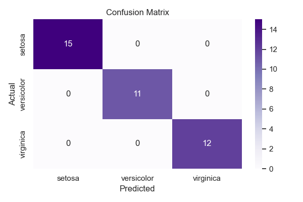

# Support Vector Machines (SVM) - Iris Dataset Classification

This project implements **Support Vector Machines (SVM)** for classifying species of the Iris flower dataset. It includes both **linear and non-linear classification**, visualization of decision boundaries using **PCA**, and **hyperparameter tuning** with `GridSearchCV`.

---

## 📁 Project Structure

Support Vector Machines (SVM)
│
├── data/
│ └── Iris.csv
│
├── notebooks/
│ └── svm_classification.ipynb
│
├── visuals/
│ ├── svm_confusion_matrix.png
│ ├── svm_decision_boundary.png
│ 
└── README.md

---

## 📌 Objectives

- Understand SVM fundamentals: margin maximization, support vectors.
- Implement linear and RBF kernels.
- Visualize high-dimensional classification using PCA.
- Perform basic evaluation of model performance.

---

## 📊 Dataset

- **Source**: [Iris Dataset on Kaggle](https://www.kaggle.com/datasets/uciml/iris)
- **Features**:
  - Sepal Length
  - Sepal Width
  - Petal Length
  - Petal Width
- **Target**: Species (`setosa`, `versicolor`, `virginica`)

---

## ✅ Tasks Performed

1. **Data Preprocessing**
   - Loaded dataset and checked class distribution.
   - Normalized features using `StandardScaler`.
   - Encoded target labels using `LabelEncoder`.

2. **Model Building**
   - Trained SVM with linear kernel.
   - Trained SVM with RBF kernel and visualized decision boundaries using PCA.

3. **Evaluation**
   - Calculated accuracy, confusion matrix, and classification report.
   - Visualized confusion matrix as a heatmap.

---

## 🔍 Key Learnings

- Importance of **feature scaling** in SVM.
- Visualization through **dimensionality reduction** (PCA) helps interpret classifier behavior.
- SVM with **RBF kernel** can model complex boundaries better than linear kernel.

---

## 📷 Sample Visuals

- **PCA-Based Decision Boundary**  
  

- **Confusion Matrix**  
  

---

## ❓ Interview Readiness

Here are some SVM-related questions this project helps you prepare for:

- What is a support vector?
- How does the `C` parameter control the margin?
- What’s the role of `kernel` and how does the RBF kernel work?
- How do you deal with non-linearly separable data?
- Can SVM be used for regression tasks?

---

## 🔗 Useful Links

- [Scikit-learn - SVM Documentation](https://scikit-learn.org/stable/modules/svm.html)
- [Iris Dataset on Kaggle](https://www.kaggle.com/datasets/uciml/iris)

---

